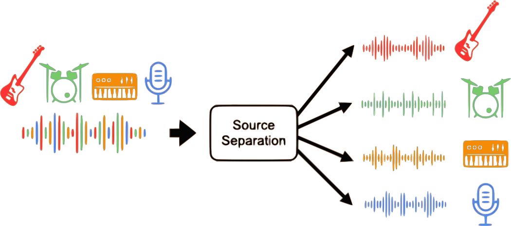

# Free AI-based music demixing web app

Upload a song to decompose it into **bass, drums, vocals, other, and karaoke** components by applying **music source separation** (aka **music demixing**), powered by a near-state-of-the-art AI model, [Open-Unmix](https://github.com/sigsep/open-unmix-pytorch), with the [UMX-L](https://zenodo.org/record/5069601) pretrained weights. This site is created and maintained by [Sevag H](https://github.com/sevagh).

### Runs locally in your browser!

Unlike competing products, **it's free to use and doesn't store your data.** All processing is done in your browser, and your files are never uploaded anywhere. It works on computers and smartphones.

## Demixer app

Need a music file for a demo? Download [a free song by Jaxius Music](https://www.jaxiusmusic.com/file-share/4a94f6cf-a844-4d72-b849-328829fe158f) to get started!

    <button id="load-weights">Download weights (45 MB)</button>
    

        
Downloading weights...

        

            

        

    

    
    <input type="file" id="audio-upload">
     
    <button id="load-waveform" class="button">Load audio and demix</button>
     
    

        
Demixing progress...

        

            

        

    

To cancel the running job, refresh the page
 
 
    

        
Demixing outputs...

        

        

    

    

 <small>Photo by <a href="https://unsplash.com/@son_of_media?utm_source=unsplash&utm_medium=referral&utm_content=creditCopyText">Dylan McLeod</a></small>
    

### **Disclaimers!**

* You can only use the outputs for non-commercial applications as per the <a href="https://zenodo.org/record/5069601">UMX-L weights license</a>
* The task is CPU and memory intensive (up to 4 GB), please be patient!
* Long tracks may crash due to the 4 GB RAM limitation; try to keep them 5 minutes or shorter
* Input files can be almost any audio format, but the outputs are always stereo wav files @ 44100 Hz

## Technical details

The inference code is written in C++, using Eigen3 for numerical operations. Emscripten is used to compile it to WebAssembly. The model weights are quantized and compressed from 424 MB down to 45 MB with a slight hit to performance. [View source code on GitHub](https://github.com/sevagh/free-music-demixer).

This is a web adaptation of [umx.cpp](https://github.com/sevagh/umx.cpp), which is more focused on parity with the original model. This project was inspired by the "AI at the edge" [GGML project](https://ggml.ai/) (including [whisper.cpp](https://github.com/ggerganov/whisper.cpp) and [llama.cpp](https://github.com/ggerganov/llama.cpp)), and WebAssembly is a great demo of client-side AI.
