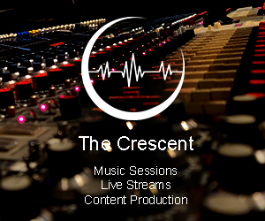
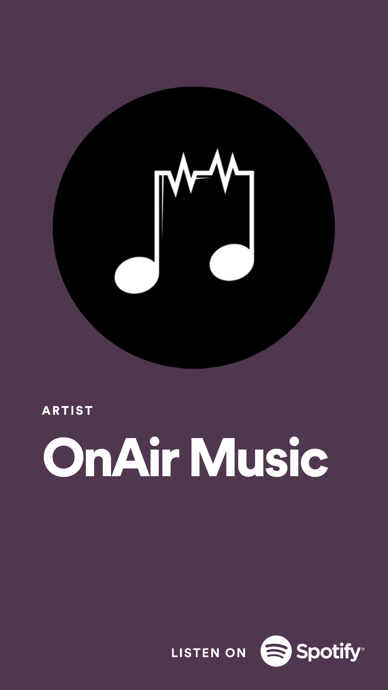

# Sponsors

We are eagerly establishing partnerships with our friends in pro audio recording, production, and any slice of the music industry related to mixing, remixing, demixing, and stem separation.

The current format is 160px-wide skyscraper ad banners on the left side of the website, provided directly by our sponsors, that redirect to our sponsors' chosen link. The ads are dynamically resized for smaller screen sizes but are always present on every page of the site.

We don't use any ad networks, and we want to establish 1:1, artisanal relationships with high-quality companies and hand-picked ad banners that are uploaded directly to our site.

If you offer a pro demixing service, we can explore a deeper partnership where this site is encouraged for free proofs of stems for the user's demo project, and the user is funneled to your pro service for the final stems.

Interested? [Contact us!](mailto:sevagh+freemdx@protonmail.com)

## The Crescent

We are currently partnered with [The Crescent](https://www.thecrescentmtl.com), a company based in Montreal that provides music, live stream concerts, and content production. Check them out!

## OnAir Music

We also work with [OnAir Music](https://open.spotify.com/artist/7IYLENV1pGGPvL6wkyl7t5), a collection of royalty-free music for use in Twitch streams and other applications. OnAir has also contributed a [stem dataset for AI music demixing research](https://github.com/sevagh/OnAir-Music-Dataset) to help researchers develop better AI stem separation applications (like the one that powers this website).

